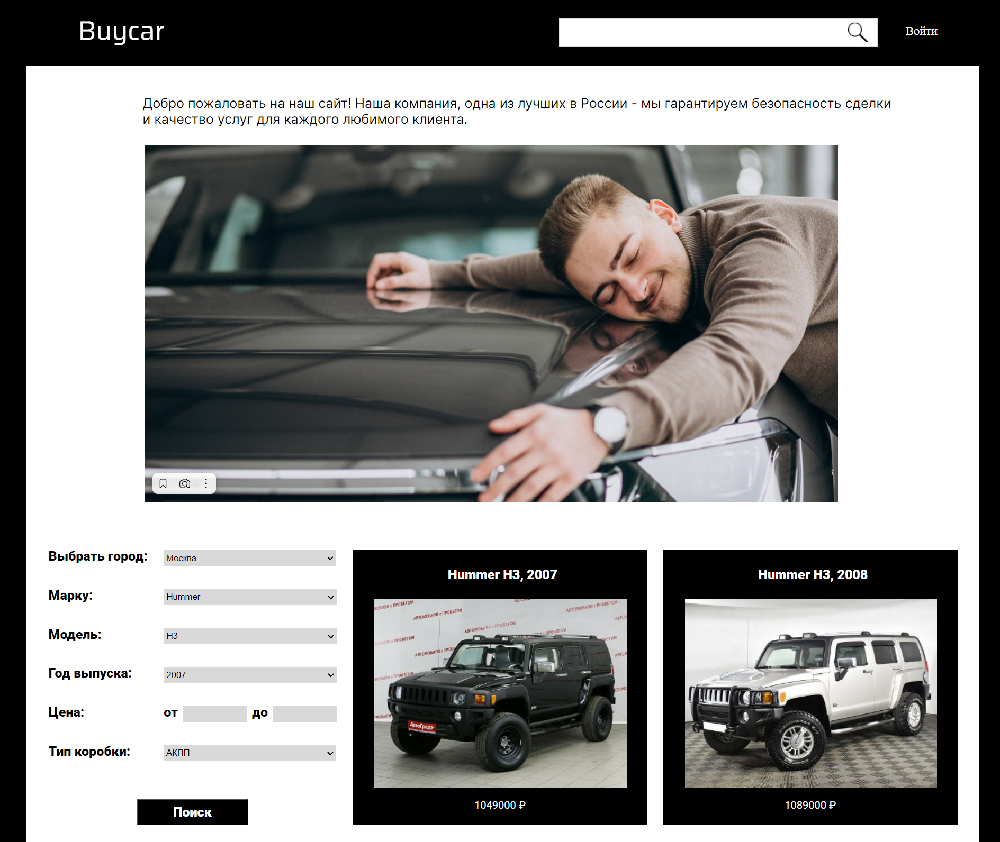

# Car-parser-project
Парсер сайтов с объявлениями о продажах машин.


## Репозиторий
В данном репозитории находится бэкенд-состовляющая проекта.
> Фронтенд часть находиться в [этом](https://github.com/karinaKarinakarinaKarina/buycarsite_front) репозитории.
## Особенности
- Поиск объявлений с нескольких сайтов
- Актуализация объявлений раз в час
- Фильтрация по параметрам
- ~~Добавление понравившегося в избранное~~
## Установка и запуск
Допускается два способа запуска программы
### Нативный запуск
Для запуска необходим python(3.11) и PostgreSQL.
1. Скачать проект в формате .zip и распаковать или с помощью git clone.
2. Установить дополнительные библиотеки с помощью команды
```bash
pip install -r requirements.txt
```
3. Создать базу данных carParser в PostgreSQL
4. Создать файл ".env" в корневой папке проекта с содержанием:
```
POSTGRES_PASSWORD="{пароль от базы данных}"
SECRET_KEY="{ключ для хеш-функции паролей}"
HOST_NAME="localhost"
```
5. Запустить проект с помощью команды
```bash
flask --app flask_app.py run --port 5000
```
### Запуск через Docker
Для запуска нужен Docker и Docker Compose(либо Docker Desktop)
1. Скачать проект в формате .zip и распаковать или с помощью git clone скачать репозиторий.
2. Создать файл ".env" в корневой папке проекта с содержанием:
```
POSTGRES_PASSWORD="{пароль от базы данных}"
SECRET_KEY="{ключ для хеш-функции паролей}"
HOST_NAME="database"
```
3. Запустить проект с помощью команды:
```bash
docker-compose up --build
```
## Документация
Документация находится в разделе [wiki](https://github.com/HROMAYAKOZA/Car-parser-project-back/wiki) репозитория.
## Участники
- [Бэкенд-разработчик](https://github.com/haribo0372) сервера и базы данных
- [Бэкенд-разработчик](https://github.com/deBath) парсеров
- [Фронтенд-разработчик](https://github.com/Sn0wEagle1)
- [UI/UX-дизайнер](https://github.com/karinaKarinakarinaKarina)
- [DevOps-инженер](https://github.com/HROMAYAKOZA)
